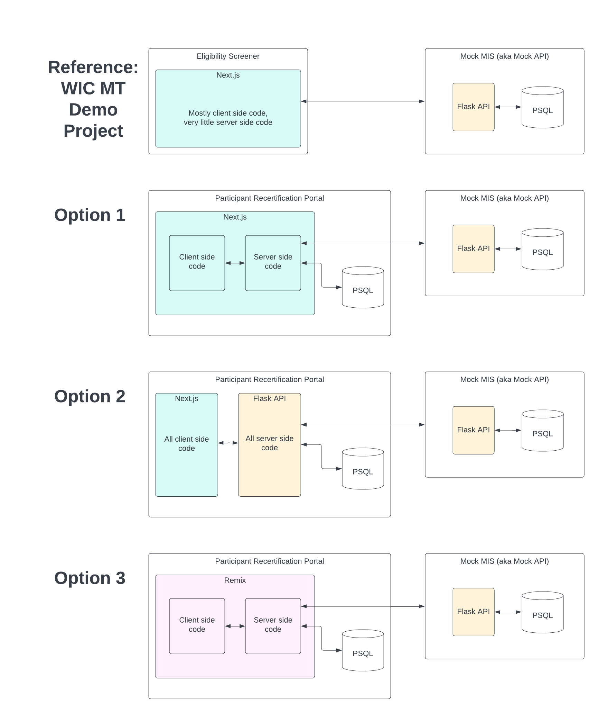

# Use Remix for project architecture

* Status: accepted
* Deciders: @rocketnova, @aplybeah, @microwavenby
* Date: 2022-11-30

Technical Story: https://wicmtdp.atlassian.net/browse/PRP-42

Tech Spec: https://navasage.atlassian.net/wiki/spaces/MWDP/pages/553123898/Tech+Spec+Project+Architecture+PRP

## Context and Problem Statement

What framework do we want to use to build the Participant Recertification Portal?

## Decision Drivers

* We want to make a compelling case that the Portal is a widget that can plug-and-play into any MIS
* We want to continue building out the case for a WIC API standard by adding endpoints to the Mock MIS (aka Mock API)
* We want to make it easy for other organizations to adopt, extend, and deploy our open source code
* We want to iteratively improve on some of the less successful approaches we used when building the Eligibility Screener built for the WIC MT Demonstration Project

## Considered Options

* Option 1 - Use Next.js for frontend and backend + PostgreSQL DB
* Option 2 - Use Next.js for frontend and connect to a Flask API + PostgreSQL DB for a backend
* Option 3 - Use Remix for frontend and backend + PostgreSQL DB

## Decision Outcome

We decided on using Remix as both the frontend and backend because we believe it will relieve a lot of the pain points in Next.js, specifically because it is built for multi-page form wizards, with form handling and auth options built-in.

## Pros and Cons of the Options

### Option 1 - Use Next.js for frontend and backend + PostgreSQL DB

Summary: Build the PRP as a Next.js application, using Next.js to handle client-side logic and for server-side logic. Data persistence would be handled by integrating Next.js directly with a PostgreSQL database.

#### Pros/Cons

* Good, because this uses a single language (Typescript) and framework (Next.js) across the project
* Good, because this leverages previous experience the team and Nava engineers have with Next.js
* Bad, because Typescript is fiddly
* Bad, because Next.js' abstractions mean developer needs to carefully manage the nuances of whether code is running client-side vs server-side
* Bad, because form handling and data validation is not included in Next.js

### Option 2 - Use Next.js for frontend and connect to a Flask API + PostgreSQL DB for a backend

Summary: Use Next.js just for client-side functionality and use a Flask API to handle server-side functionality. Data persistence would be handled using a PostgreSQL database connected to the Flask API.

#### Pros/Cons

* Good, because this leverages previous experience the team and Nava engineers have with Next.js
* Good, because this leverages previous experience the team and Nava engineers have with Flask/python APIs
* Good, because it uses the same approach as used for the [WIC Mock API](https://github.com/navapbc/wic-mt-demo-project-mock-api) that this project will integrate with
* Good, because it creates a clean separation of concerns and gains benefits of the [Jamstack](https://jamstack.org) approach
* Bad, because Typescript is fiddly
* Bad, because it adds more infrastructure components to manage
* Bad, because it adds a potential barrier to open source adoption by increasing the technical knowledge required
* Bad, because form handling and data validation is not included in Next.js
* Bad, because data validation is either not handled client-side or data validation is duplicated in different languages client-side and server-side

### Option 3 - Use Remix for frontend and backend + PostgreSQL DB

Summary: Use Remix (instead of Next.js) for both client-side logic and for server-side logic. Data persistence would be handled by integrating Remix directly with a PostgreSQL database.

#### Pros/Cons

* Good, because Remix relieves a lot of Next.js pain points.
* Good, because it uses a single language (Typescript) and framework (Remix) across the project
* Good, because Remix's server-side approach side steps the necessity of managing the nuances of whether code is running client-side vs server-side
* Good, because Remix handles form data out-of-the-box, which makes building multi-page form wizards much easier
* Good, because (generally) Remix is faster to render than other frameworks
* Good, because Remix uses HTML interactions consistently to send data to Loader functions server-side (on GET requests) and Action functions (on other types of requests)
* Good, because Remix sites can be built to function with javascript disabled
* Bad, because Typescript is fiddly
* Bad, because Remix is a new framework to the team
* Bad, because Remix was recently acquired and may be less stable as a result

